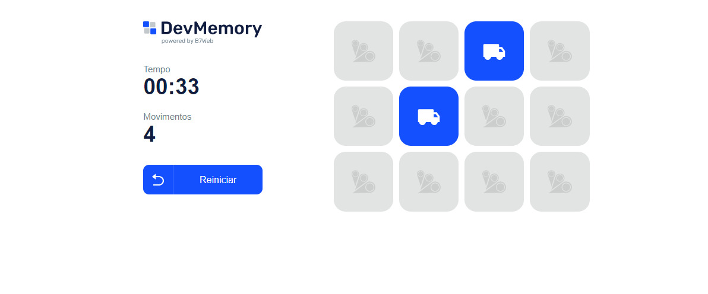

<h1 align="center"> DevMemory </h1>

Este projeto foi feito em aula do curso B7Web.  

  <a href="#-tecnologias">Tecnologias</a>

 

  

## 🚀 Tecnologias

Esse projeto foi desenvolvido com as seguintes tecnologias:

- ReactJs
- TypeScript
- Git e Github

## 💻 Projeto

O "DevMomory" é um  Jogo da Memória virtual.

---

 ## In the project directory, you can run:

### `npm start`

Runs the app in the development mode.\
Open [http://localhost:3000](http://localhost:3000) to view it in the browser.

The page will reload if you make edits.\
You will also see any lint errors in the console.

### `npm run build`

Builds the app for production to the `build` folder.\
It correctly bundles React in production mode and optimizes the build for the best performance.

The build is minified and the filenames include the hashes.\
Your app is ready to be deployed!

See the section about [deployment](https://facebook.github.io/create-react-app/docs/deployment) for more information.

---

Feito com ♥ by Pedro Henrique  curso [B7Web](https://b7web.com.br)